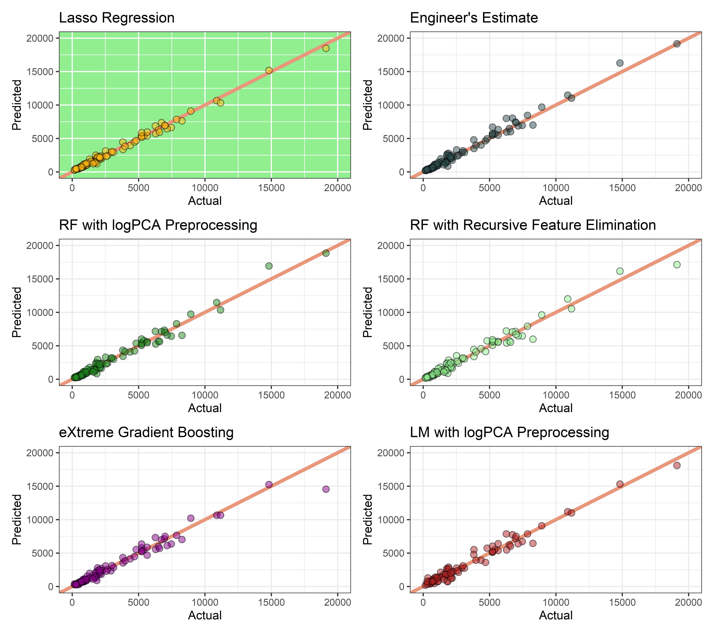

First-Price Procurement Auctions
================

This repository contains my master thesis on first-price sealed-bid
procurement auctions. In particular, the aim is to predict award prices
of auctions held by the [Colorado Department of
Transportation](https://codot.gov/business/bidding/bid-tab-archives). To
date, the following models with varying preprocessing schedules have
been compared:

-   Elastic Net
-   Linear Model
    -   [with logistic PCA preprocessing (parallel
        CV)](https://github.com/Base-R-Best-R/Auction/blob/main/Code/Models/Colab/CV_PreProcess_LM.ipynb)
-   Random Forest
    -   [with recursive feature elimination (parallel
        CV)](https://github.com/Base-R-Best-R/Auction/blob/main/Code/Models/Colab/CV_RecursiveFeatureElimination_RF.ipynb)
    -   [with logistic PCA
        preprocessing](https://github.com/Base-R-Best-R/Auction/blob/main/Code/Models/Colab/Nested_CV_PCA_RF.ipynb)
    -   [with logistic PCA preprocessing (parallel
        CV)](https://github.com/Base-R-Best-R/Auction/blob/main/Code/Models/Colab/Parallel_NestedCV_RF.ipynb)
-   [XGBoost](https://github.com/Base-R-Best-R/Auction/blob/main/Code/Models/Colab/XGboost.ipynb)

# Best Model (07/15/22)

The boxplots below display the out of sample predicted values for the
lasso regression and the random forest with logistic PCA preprocessing.
Further, as the Engineers Estimate may be considered as a benchmark for
prediction it is also included in the plot.

<!-- -->

The boxplot shows that the Lasso regression seems to be able to predict
the outliers the best when compared to the remaining models and the
Engineer’s Estimate as a benchmark.

<!-- -->

The plots above display the actual vs. predicted values. These plots may
be used to assess whether certain models just predict the outliers
better, which is evident from the boxplots of predicted values. We
observe that the Lasso model seems to outperform the other models across
most of the observations in the validation set.

|      |    Lasso | logPCA_LM | logPCA_RF |   rfe_RF |      XGB | Eng. Est. |
|:-----|---------:|----------:|----------:|---------:|---------:|----------:|
| RMSE | 326.1261 |  609.4673 |  509.7934 | 536.9718 | 671.6634 |  497.0567 |
| MAE  | 241.7894 |  448.2662 |  348.2869 | 366.6570 | 376.3191 |  327.9388 |

The performance comparison utilizing linear and quadratic loss functions
further emphasizes the dominance of the Lasso model.

# Required Software

## Installing Tabulizer for R \> 4.1

Unfortunately, the implementation of the Java library tabula which is a
package called tabulizer cannot be installed via *install.packages()*
and further the installation
[guide](https://github.com/ropensci/tabulizer) is not up to date.
However, with a small adaption the installation works almost as
described in the installation guide for windows 10.

    ## R version 4.2.1 (2022-06-23 ucrt)
    ## Platform: x86_64-w64-mingw32/x64 (64-bit)
    ## Running under: Windows 10 x64 (build 19044)
    ## 
    ## Matrix products: default
    ## 
    ## locale:
    ## [1] LC_COLLATE=German_Austria.utf8  LC_CTYPE=German_Austria.utf8   
    ## [3] LC_MONETARY=German_Austria.utf8 LC_NUMERIC=C                   
    ## [5] LC_TIME=German_Austria.utf8    
    ## 
    ## attached base packages:
    ## [1] stats     graphics  grDevices utils     datasets  methods   base     
    ## 
    ## other attached packages:
    ## [1] ggplot2_3.3.6   Metrics_0.1.4   patchwork_1.1.1 lubridate_1.8.0
    ## 
    ## loaded via a namespace (and not attached):
    ##  [1] highr_0.9        pillar_1.7.0     compiler_4.2.1   tools_4.2.1     
    ##  [5] digest_0.6.29    evaluate_0.15    lifecycle_1.0.1  tibble_3.1.7    
    ##  [9] gtable_0.3.0     pkgconfig_2.0.3  rlang_1.0.3      cli_3.3.0       
    ## [13] DBI_1.1.3        rstudioapi_0.13  yaml_2.3.5       xfun_0.31       
    ## [17] fastmap_1.1.0    withr_2.5.0      stringr_1.4.0    dplyr_1.0.9     
    ## [21] knitr_1.39       generics_0.1.3   vctrs_0.4.1      grid_4.2.1      
    ## [25] tidyselect_1.1.2 glue_1.6.2       R6_2.5.1         fansi_1.0.3     
    ## [29] rmarkdown_2.14   farver_2.1.1     purrr_0.3.4      magrittr_2.0.3  
    ## [33] scales_1.2.0     ellipsis_0.3.2   htmltools_0.5.2  assertthat_0.2.1
    ## [37] colorspace_2.0-3 labeling_0.4.2   utf8_1.2.2       stringi_1.7.8   
    ## [41] munsell_0.5.0    crayon_1.5.1

Three steps have to be altered:

-   When using Chocolately to install Java via the command prompt
    specify `choco install jdk8 -y` instead of `choco install jdk7 -y`
-   Within R change
    `Sys.setenv(JAVA_HOME = "C:/Program Files/Java/jdk1.8.0_92")` to
    `Sys.setenv(JAVA_HOME = "C:/Program Files/Java/jdk1.8.0_211")`
-   Then install via
    `remotes::install_github(c("ropensci/tabulizerjars", "ropensci/tabulizer"), INSTALL_opts = "--no-multiarch")`,
    **after** installing *rJava* the usual way, i.e., via
    `install.packages()`
