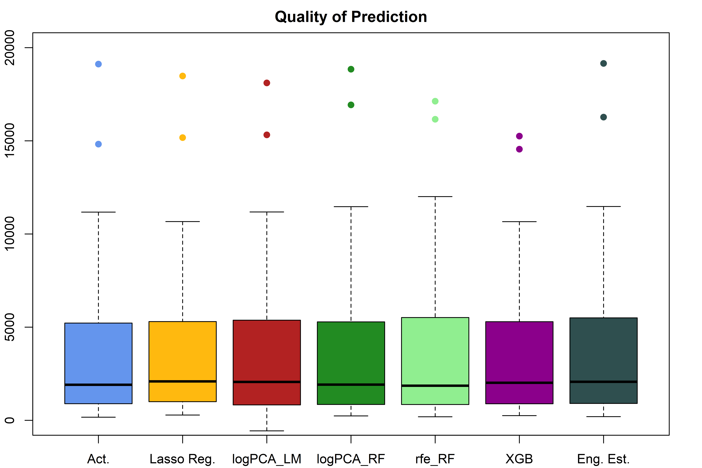

First-Price Procurement Auctions
================

This repository contains my master thesis on first-price sealed-bid
procurement auctions. In particular, the aim is to predict award prices
of auctions held by the [Colorado Department of
Transportation](https://codot.gov/business/bidding/bid-tab-archives). To
date, the following models with varying pre-processing schedules have
been compared:

-   Elastic Net
-   Random Forest
    -   [including logistic PCA
        preprocessing](https://github.com/Base-R-Best-R/Auction/blob/main/Code/Models/Colab/Nested_CV_PCA_RF.ipynb)
-   [XGBoost](https://github.com/Base-R-Best-R/Auction/blob/main/Code/Models/Colab/XGboost.ipynb)

# Best Model (07/07/22)

The boxplots below display the out of sample predicted values for the
lasso regression and the random forest with logistic PCA pre-processing.
Further, as the Engineers Estimate may be considered as a benchmark for
prediction it is also included in the plot.

<!-- -->

The boxplot shows that the Lasso regression seems to be able to predict
the outliers the best when compared to the random forest and the
Engineers Estimate.

|      |    Lasso |       RF |      XGB | Eng. Est. |
|:-----|---------:|---------:|---------:|----------:|
| RMSE | 326.1261 | 509.7934 | 671.6634 |  497.0567 |
| MAE  | 241.7894 | 348.2869 | 376.3191 |  327.9388 |

The performance comparison utilizing linear and quadratic loss functions
further emphasizes the dominance of the Lasso model.

# Required Software

## Installing Tabulizer for R \> 4.1

Unfortunately, the implementation of the Java library tabula which is a
package called tabulizer cannot be installed via *install.packages()*
and further the installation
[guide](https://github.com/ropensci/tabulizer) is not up to date.
However, with a small adaption the installation works almost as
described in the installation guide for windows 10.

    ## R version 4.1.2 (2021-11-01)
    ## Platform: x86_64-w64-mingw32/x64 (64-bit)
    ## Running under: Windows 10 x64 (build 19044)
    ## 
    ## Matrix products: default
    ## 
    ## locale:
    ## [1] LC_COLLATE=German_Austria.1252  LC_CTYPE=German_Austria.1252   
    ## [3] LC_MONETARY=German_Austria.1252 LC_NUMERIC=C                   
    ## [5] LC_TIME=German_Austria.1252    
    ## 
    ## attached base packages:
    ## [1] stats     graphics  grDevices utils     datasets  methods   base     
    ## 
    ## loaded via a namespace (and not attached):
    ##  [1] compiler_4.1.2    magrittr_2.0.1    cli_3.0.1         tools_4.1.2      
    ##  [5] htmltools_0.5.1.1 rstudioapi_0.13   yaml_2.2.1        stringi_1.6.1    
    ##  [9] rmarkdown_2.14    highr_0.9         knitr_1.33        stringr_1.4.0    
    ## [13] xfun_0.23         digest_0.6.27     Metrics_0.1.4     rlang_1.0.2      
    ## [17] evaluate_0.14

Three steps have to be altered:

-   When using Chocolately to install Java via the command prompt
    specify `choco install jdk8 -y` instead of `choco install jdk7 -y`
-   Within R change
    `Sys.setenv(JAVA_HOME = "C:/Program Files/Java/jdk1.8.0_92")` to
    `Sys.setenv(JAVA_HOME = "C:/Program Files/Java/jdk1.8.0_211")`
-   Then install via
    `remotes::install_github(c("ropensci/tabulizerjars", "ropensci/tabulizer"), INSTALL_opts = "--no-multiarch")`,
    **after** installing *rJava* the usual way, i.e., via
    `install.packages()`
